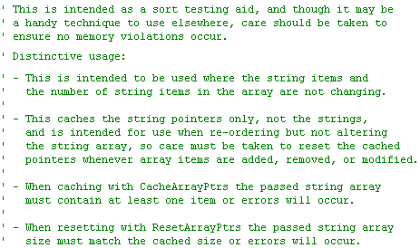

<div align="center">

## String array pointers fast caching technique


</div>

### Description

This is a simple string pointer caching technique that speeds up the testing of algorithms that manipulate string array pointers such are string sorting routines ...

I found the most time consuming part of sort testing was the resetting of the test array before every test ...

This is a solution that removes the need to re-assign strings into a test array before every test is started ...

This module contains two sub-routines named CacheArrayPtrs and ResetArrayPtrs ...

You call CacheArrayPtrs whenever the array is loaded with new items ...

You call ResetArrayPtrs before every test and instantly be ready to test the original cached array ... Update 16 Oct 09 to correct an error in the documentation only ...

Usage code included in 3kb zip.
 
### More Info
 


<span>             |<span>
---                |---
**Submitted On**   |2008-02-16 13:46:52
**By**             |[Rde](https://github.com/Planet-Source-Code/PSCIndex/blob/master/ByAuthor/rde.md)
**Level**          |Intermediate
**User Rating**    |4.8 (24 globes from 5 users)
**Compatibility**  |VB 4\.0 \(32\-bit\), VB 5\.0, VB 6\.0
**Category**       |[String Manipulation](https://github.com/Planet-Source-Code/PSCIndex/blob/master/ByCategory/string-manipulation__1-5.md)
**World**          |[Visual Basic](https://github.com/Planet-Source-Code/PSCIndex/blob/master/ByWorld/visual-basic.md)
**Archive File**   |[String\_arr21652910162009\.zip](https://github.com/Planet-Source-Code/rde-string-array-pointers-fast-caching-technique__1-70103/archive/master.zip)

### API Declarations

```
CopyMemory API
ZeroMemory API
'
'Sub LoadArray()
'
' ' Code to load test
' ' strings into array
' '...
'
' ' Whenever the array is
' ' re-loaded cache the
' ' pointers in their
' ' original order
' CacheArrayPtrs sTestArray
'
'End Sub
'
'Sub SortTest()
'
' ' Reset the array items
' ' back to their original
' ' positions just before
' ' each new sorting test
' ResetArrayPtrs sTestArray
'
' ' Do the sorting
' strSort sTestArray
'
'End Sub
'
```


